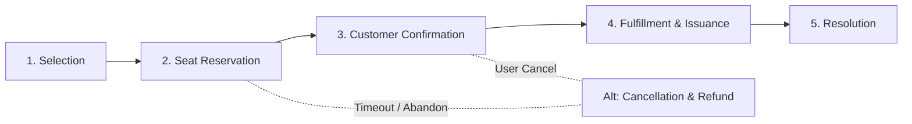

# CineWave Case Lifecycle Specification

## Case Type Information
- **Case Type**: `Ticket Booking`
- **Class**: `CineWave-Work-TicketBooking`
- **Prefix**: `TICK-`
- **Direct Inheritance**: `Work-Cover-` / `Theme-Cosmos`

---

## Primary Stages & Step Definition

### Stage 1: Selection
- **Stage ID**: `STG-01-Selection`
- **Type**: Primary Stage
- **Entry Status**: `New`
- **Steps**:
  1. `CollectMovieAndTheatre`: User action routed to `CurrentOperator` (Customer). View displays list of movies, filterable by city/theatre.
  2. `CollectShowtime`: Sourced from `D_ShowtimesByMovieAndDate`.

### Stage 2: Seat Reservation
- **Stage ID**: `STG-02-SeatReservation`
- **Type**: Primary Stage
- **Entry Status**: `Pending-SeatSelection`
- **Steps**:
  1. `RenderSeatLayout`: UI section displaying interactive tiered grid (`Standard`, `Premium`, `VIP`).
  2. `LockSeatsSLA`: Automated Service Level Agreement rule.
     - **Goal**: 5 minutes
     - **Deadline**: 10 minutes
     - **Escalation**: Move to Alternate Stage (*Cancellation & Refund*).
  3. `CalculateFareDataTransform`: Computes base fare, 10% convenience fee, and 18% GST.

### Stage 3: Customer Confirmation
- **Stage ID**: `STG-03-CustomerConfirmation`
- **Type**: Primary Stage
- **Entry Status**: `Pending-CustomerDetails`
- **Steps**:
  1. `CollectCustomerInfo`: Form collecting `FullName`, `Email`, `Phone`, and optional `Notes`.
  2. `ValidateCustomerData`: Validate rule checking valid email structure and phone length.
  3. `ApplyPromoDiscount`: When rule `IsPromoValid` deducting 20% discount if code `CINEWAVE20` is entered.
  4. `ProcessPayment`: Collect payment mode (Card, Apple Pay, UPI) and simulate transaction token.

### Stage 4: Fulfillment & Issuance
- **Stage ID**: `STG-04-Fulfillment`
- **Type**: Primary Stage
- **Entry Status**: `Pending-Issuance`
- **Steps**:
  1. `GenerateETicket`: Generates unique transaction hash and digital QR code payload.
  2. `DispatchNotification`: Pega Correspondence rule sending email to customer containing ticket details.

### Stage 5: Resolution
- **Stage ID**: `STG-05-Resolution`
- **Type**: Resolution Stage
- **Resolved Status**: `Resolved-Completed`
- **Steps**:
  1. `CloseCase`: Commits case history and closes active work item.

---

## Alternate Stage: Cancellation & Refund

- **Stage ID**: `STG-ALT-Cancellation`
- **Type**: Alternate Stage
- **Entry Status**: `Pending-Cancellation`
- **Resolved Status**: `Resolved-Cancelled`
- **Steps**:
  1. `ValidateCancellationEligibility`: When rule checking if showtime is $> 2$ hours away.
  2. `ReleaseSeatInventory`: Automation updating `CineWave-Data-Showtime` occupied seat list.
  3. `ProcessRefund`: Reverses payment transaction.
  4. `SendCancellationNotification`: Correspondence email alerting customer of cancellation.
